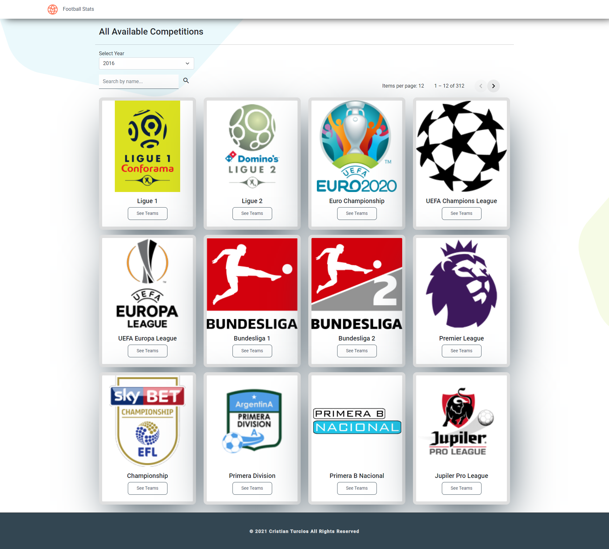
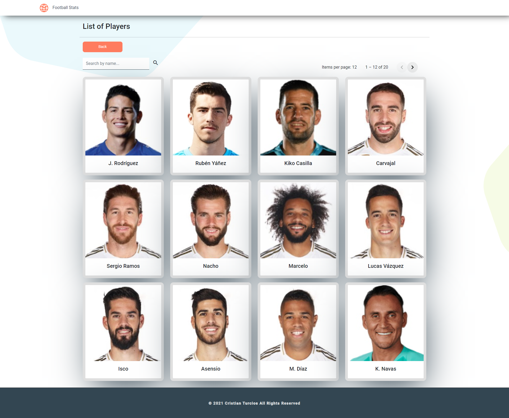
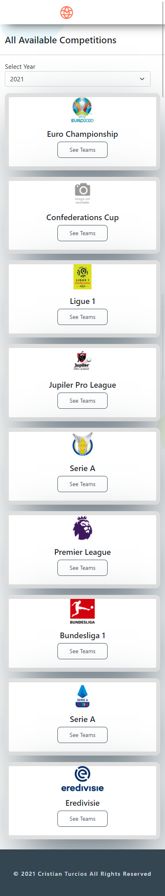

# FootballStats

This project was generated with [Angular CLI](https://github.com/angular/angular-cli) version 12.0.4.

## Live Demo

you can see a live demo [here](https://thirsty-curie-7274bc.netlify.app/).

## Technologies

- Bootstrap 5
- Angular 12
- TypeScript

## Installation

```bash
$ npm install
```

## Running the app

```bash
# development
$ ng serve -o
```

## Test

```bash
# unit tests
$ ng test
```

## Web App Screenshots







