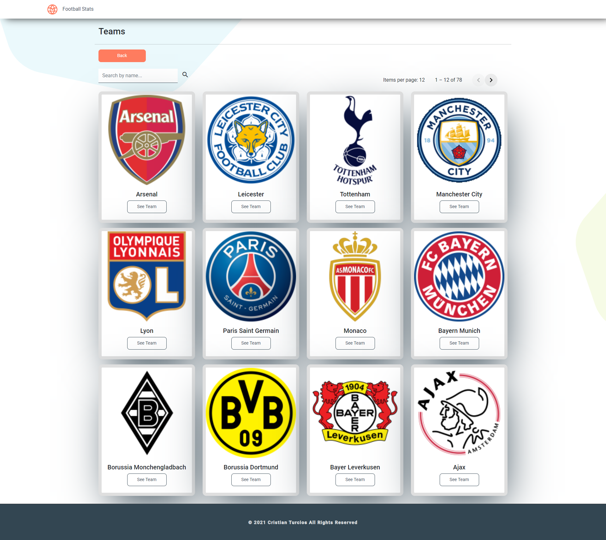

# FootballStats

This project was generated with [Angular CLI](https://github.com/angular/angular-cli) version 12.0.4.

## Live Demo

you can see a live demo [here](https://thirsty-curie-7274bc.netlify.app/).

## Technologies

- Bootstrap 5
- Angular 12
- TypeScript

## Requirements

- Shows a list of all competitions based on a season input by user.
- Selecting a competition shows all the teams for that competition on a DIFFERENT page
- Selecting a team shows ANOTHER page with team information and a list of all players on that team
- Allow the ability to navigate to previous pages and select another value.

## Installation

```bash
# Installation
$ npm install
```

## Running the app

```bash
# development
$ ng serve -o
```

## Test

```bash
# unit tests
$ ng test
```

## Web App Screenshots





